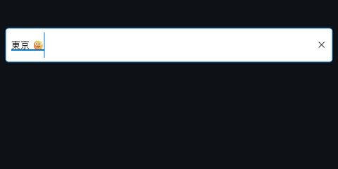

# Embedded text-state validation

This is independent DxUi library evidence for revision-checked text snapshots and composition imports. It is not
RedXe's OS text-service bridge, a real IME/screen-reader test, hardware presentation, or AV resource acceptance.
The canonical other-task checkout was untouched. The input branch integrates its exact independent-sample patch
(SHA-256 `6099a66e236e59f876b9e3107390034313ea8ba666ea7da222aaefba70f6b957`).

The unchanged-library checkout starts at 1947a5b and applies that same independent sample. Both checkouts use the
same synthetic 83-control, 1,000-row complex-ui-v2 scene, WARP, 1280×720/96 DPI and five 40-frame rounds. The
measurement process alone used affinity 0xFFFF; its original affinity was restored after each run. No other process
or power policy was changed. Source, executable, fixture, environment and round hashes/data are in the raw files.

## Final paired results

The `baseline-isolated` and `final-suite` files use the same fingerprinted minimal benchmark entry (`BenchmarkMain.h`).
The complete Debug/Release suite runs passed their retained matching comparisons with unchanged thresholds.

| Configuration | Scenario | Completed offscreen FPS | Frame p95, ms | Private bytes, MiB |
| --- | --- | --- | --- | --- |
| Debug | clean | 1812.9 → 1886.5 | 0.6585 → 0.5989 | 25.84 → 25.85 |
| Debug | dirty | 456.5 → 464.1 | 2.4992 → 2.4002 | 26.91 → 26.73 |
| Release | clean | 1845.4 → 1933.9 | 0.6077 → 0.5910 | 23.27 → 23.02 |
| Release | dirty | 556.8 → 574.0 | 1.9631 → 1.8701 | 25.20 → 25.20 |

All deterministic composition allocations, surface payload and hidden-work budgets remained unchanged. These short
runs do not establish presented FPS, hardware latency, long-run retention or cross-machine/architecture equivalence.

## Investigation retained

`first`, `repeat2` and `repeat3` retain the original three-input v2 driver results, including failures. They are not
compared to the later four-input driver. Repeated original-driver results were mixed: there were successful candidate
comparisons as well as tail/memory investigation-band failures. No thresholds were relaxed and no original baseline
was replaced. `.paired.comparison.json` files compare adjacent repeats; the ordinary comparisons retain the first baseline.

The identical minimal entry was then applied to both libraries to exclude unrelated functional-test stack locals
from benchmark entry; `isolated` records that separate matched investigation, not proof of a cause. The candidate
also reuses the existing dirty revision instead of incrementing a second counter on every invalidation. `revision`
records this source change; Release passed and Debug still exceeded its sub-10-microsecond composition threshold.
The subsequent complete-suite measurements passed both configurations against the retained isolated baselines.
Keep these earlier results and limitations when judging future changes; the passing samples do not erase them.

Original v1 diagnostics remain in RedXe and immutable library history at commit 1947a5b. They cannot validate v2.

## Functional evidence

All 18 x64 suites passed in Debug and Release; six interactive Menu capability skips were recorded per configuration.
See [suite receipts](validation.md) for executable hashes, exit codes and exact skips. Embedded tests passed 1,569
checks per configuration, including native composition painting, preview/commit/cancel, Unicode selection, malformed
ranges, stale revisions, read-only policy, retained undo/redo, hide/zero/device/attachment lifetime, foreign-thread
rejection, throwing callbacks and callback-driven tree destruction. No test invoked a real IME or changed real AV devices.

ARM64 cross-builds/native CI and consumer OS-service adoption are recorded separately; no native ARM64 pass is
claimed by these x64 receipts. The [input plan](../../../Specs/Plans/WIP/EmbeddedTextServices_2026-09-05.md) stays active.
