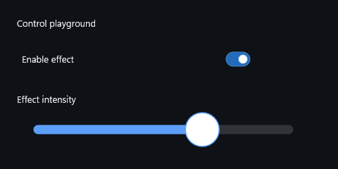
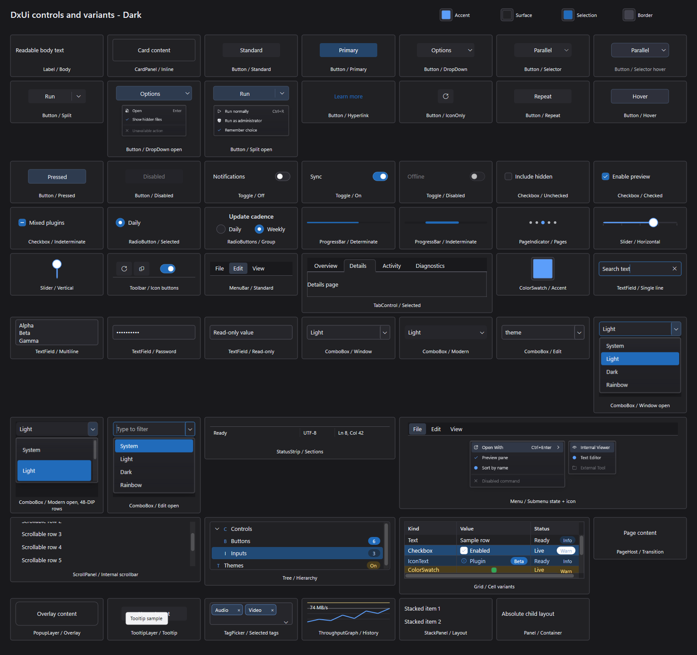
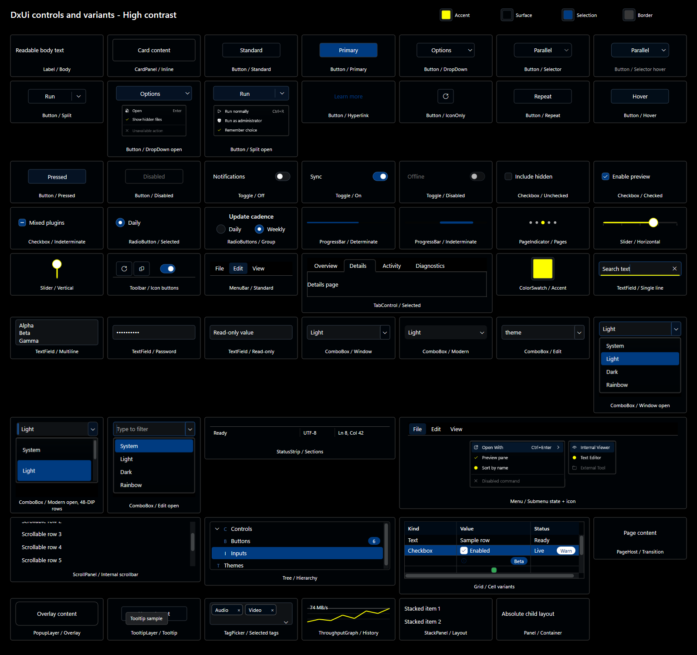
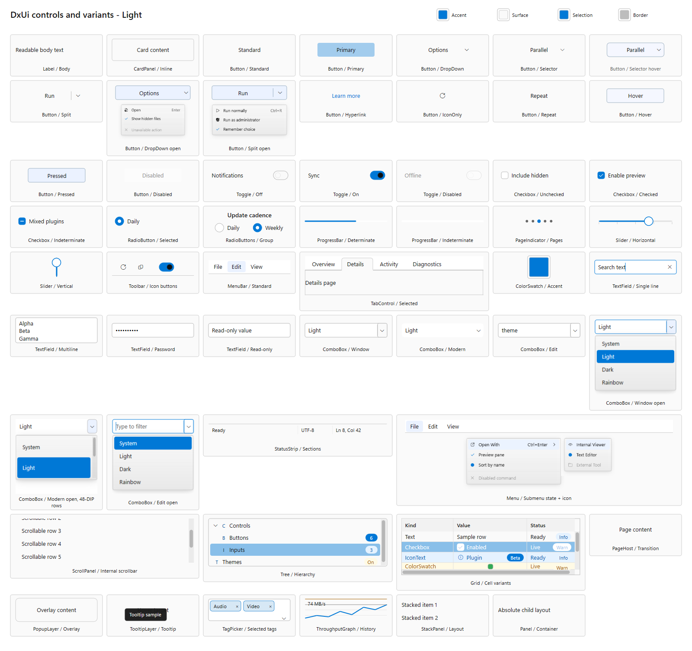
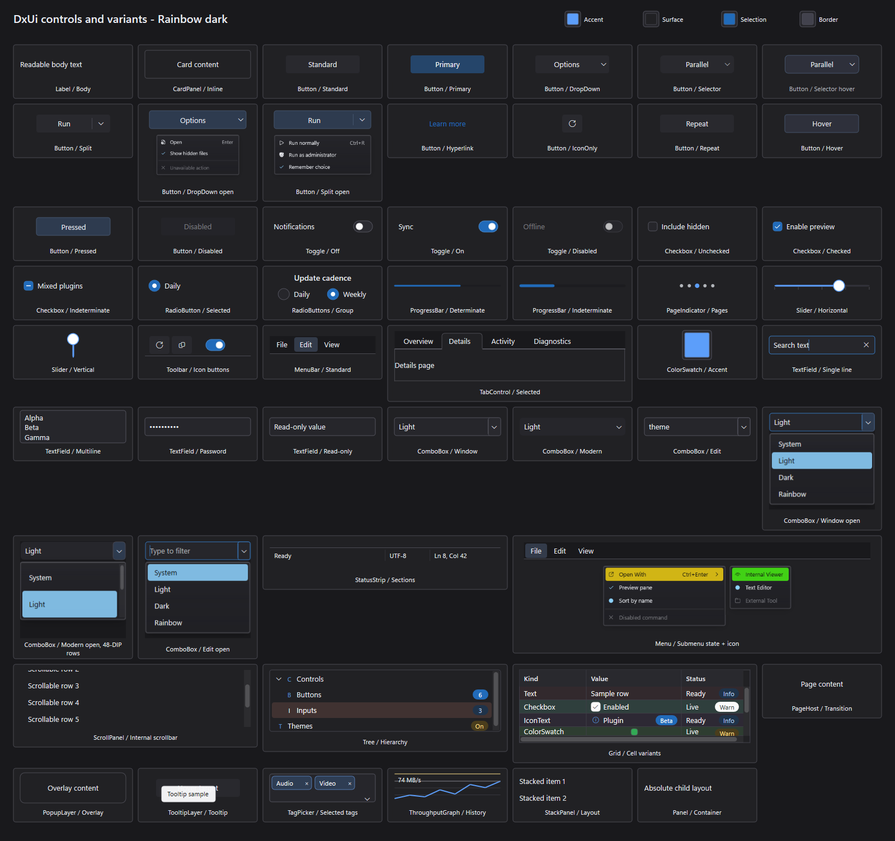
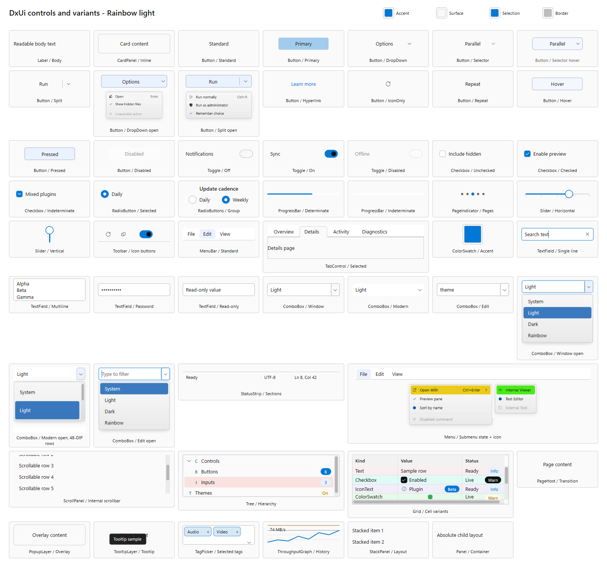

# Generated control gallery

[Usage documentation](../README.md) | [Control guide](../controls.md) | [HTML gallery](index.html)

Generated from compiled DxUi controls using gallery.ps1 -PublishDocs. The five theme sheets cover all 27 public controls and populated interaction variants; the sixth image is the supplied-device example. Click a sheet to inspect it at full resolution. Rendering may vary with Windows fonts/DPI. These are documentation snapshots, not replacements for the original test baselines.

## embedded-controls

## theme-controls-dark

## theme-controls-high-contrast

## theme-controls-light

## theme-controls-rainbow-dark

## theme-controls-rainbow-light

