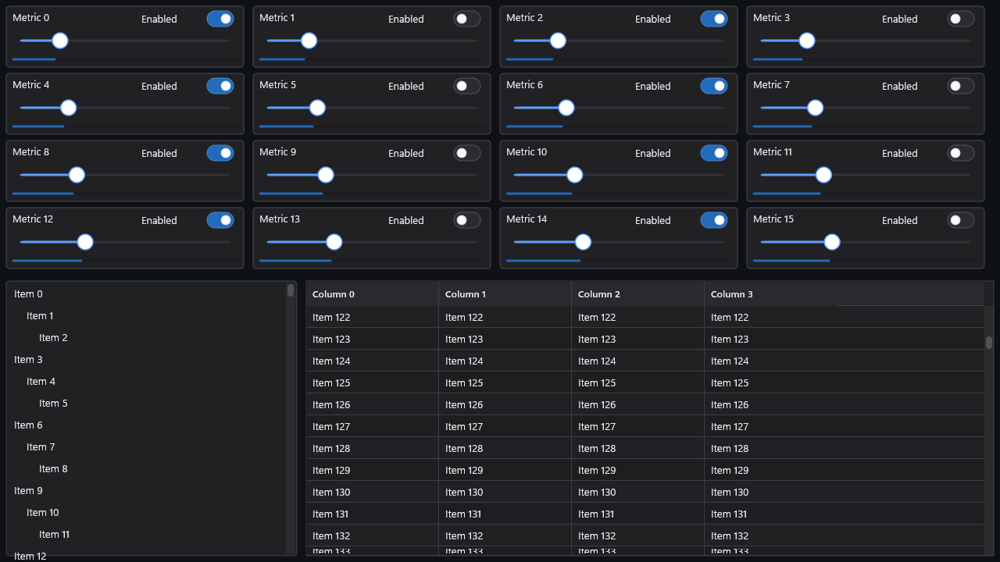

# Standalone DxUi samples

Both examples build and run entirely in DxUi. They use public library headers, Windows graphics and synthetic data.
No application checkout, plugin, user settings, audio endpoint or camera is required.

```powershell
./build.ps1 -Configuration Release -Platform x64
# Minimal event/lifetime example: effect toggle and intensity slider.
./.build/x64/Release/DxUi.EmbeddedControls.exe
# Complex library workload: 83 controls and 1,000 synthetic records.
./.build/x64/Release/DxUi.EmbeddedControls.exe --complex-ui
# Headless inspection using the same scene.
./.build/x64/Release/DxUi.EmbeddedControls.exe --complex-ui --output .build/complex-sample.png
```

The [minimal scene](../Samples/EmbeddedControls/EmbeddedScene.h) demonstrates callbacks and model state.
The [complex scene](../Samples/ComplexUi/ComplexUiScene.h) contains 16 metric cards with labels, toggles, sliders and
progress bars, plus a Grid and Tree. Dragging a slider updates its corresponding progress bar. Data is generated
locally; the example performs no system configuration or device operations.

The [sample host](../Samples/EmbeddedControls/Main.cpp) owns its WARP device, fixed-size window and swap chain.
It blocks on messages while idle. These examples demonstrate embedding at 96 DPI; full IME/UIA bridging, adaptive
layout, hardware presentation pacing and physical touch validation remain separate integration work.

The [benchmark](../Tests/Embedded/ComplexUiBenchmark.h) uses that exact complex scene, with deterministic clean/dirty
updates and GPU completion measurement. Run [performance.ps1](../performance.ps1) for FPS and memory receipts;
opening the interactive sample is not itself a benchmark. See [measurement instructions](performance.md) and
[retained independent evidence](../Measurements/README.md).


